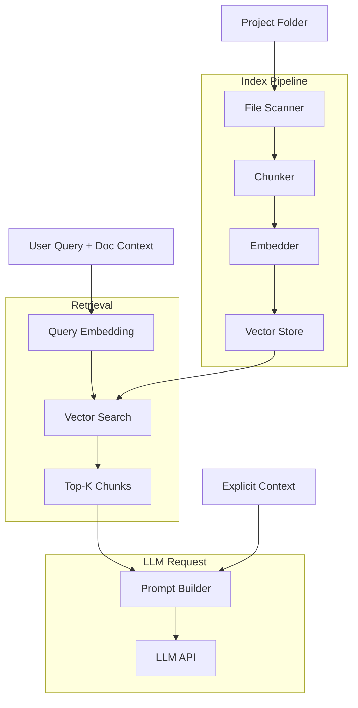

# RAG Architecture

This document describes the Phase 1 RAG (retrieval-augmented generation) architecture for Folivm. RAG indexes project folder contents and retrieves relevant chunks for each LLM request. See [EP-102](../execution/epics/EP-102-rag-project-folder.md).

---

## Scope

- Index: inputs/, working/, context/ (exclude deliverables/ by default; configurable)
- Chunking: Markdown and plain text
- Embedding: Local or API-based (same as LLM provider)
- Retrieval: Top-k relevant chunks per request
- Integration: Injected into LLM prompt alongside explicit context (Phase 0) or as replacement

---

## Architecture Overview

---

## Chunking Strategy

| Format | Strategy | Notes |
|--------|----------|-------|
| Markdown (.md) | Semantic chunking by heading; fallback to fixed-size | Preserve section boundaries; chunk size ~256–512 tokens |
| Plain text (.txt) | Fixed-size with overlap | Overlap ~50 tokens to avoid split sentences |
| YAML (.yaml, .yml) | Per-document or key-value | Context files; small; may keep whole file |

**Heading-aware chunking for Markdown:** Split on H1 or H2; each chunk is a section. If section exceeds max size, sub-split. Preserve heading as chunk metadata for retrieval context.

---

## Embedding

| Option | Pros | Cons |
|--------|------|------|
| **Same API as LLM** | Single provider; no extra local model | API cost; latency |
| **Local model (e.g. Ollama)** | No API cost; privacy | Bundle size; quality varies |
| **Dedicated embedding API** | Optimised for retrieval | Extra config; may differ from LLM provider |

**Recommendation:** Use the same provider as the LLM when possible (e.g. OpenAI embeddings with OpenAI chat). If BYOK user has no embedding endpoint, fall back to local model or disable RAG. Phase 1 can start with API-based embeddings.

---

## Retrieval

- **Vector similarity:** Cosine or dot product; return top-k (e.g. k=5–10)
- **Hybrid (optional):** Combine vector search with keyword (BM25) for robustness; Phase 1 can start vector-only
- **Reranking (optional):** Cross-encoder or LLM rerank for better precision; Phase 1 defer
- **Deduplication:** Same file appearing in multiple chunks; merge or truncate

---

## Index Lifecycle

| Event | Action |
|-------|--------|
| Project opened | Build or load index |
| File added/edited | Incremental index update (re-chunk, re-embed changed file) |
| File deleted | Remove from index |
| User excludes folder | Exclude from scan; remove existing chunks |
| Index corruption | Rebuild from project |

Index storage: local to project (e.g. `.folivm/index/`) or app data. Not committed to git.

---

## Integration with LLM Request

1. User triggers LLM request (document mode, outline mode, or deck mode)
2. System embeds query (current document excerpt + user prompt)
3. Vector search returns top-k chunks from project
4. Prompt builder assembles: system prompt + retrieved chunks + explicit context (if any) + current document + user prompt
5. LLM API called with assembled prompt
6. Response shown as suggestion; user accepts or rejects

---

## Configuration

| Setting | Default | Description |
|---------|---------|-------------|
| Indexed folders | inputs/, working/, context/ | Folders to scan |
| Excluded patterns | deliverables/, node_modules/, .git | Glob patterns to skip |
| Chunk size | 512 tokens | Max chunk size |
| Top-k | 8 | Chunks per request |
| Embedding model | Provider-default | e.g. text-embedding-3-small |

---

## Non-Scope (Phase 1)

- RAG over clause library (Phase 2)
- Multi-project or cross-project retrieval
- Server-side embedding (local-first; embedding runs in app or via same API)

---

## Related

- [EP-102 RAG over project folder](../execution/epics/EP-102-rag-project-folder.md)
- [EP-003 Project folder context](../execution/epics/EP-003-project-folder-context.md)
- [EP-005 LLM assistance](../execution/epics/EP-005-llm-assistance.md)

---

*Previous: [HLA](hla.md) · Next: [Backlog](../execution/backlog.md)*
