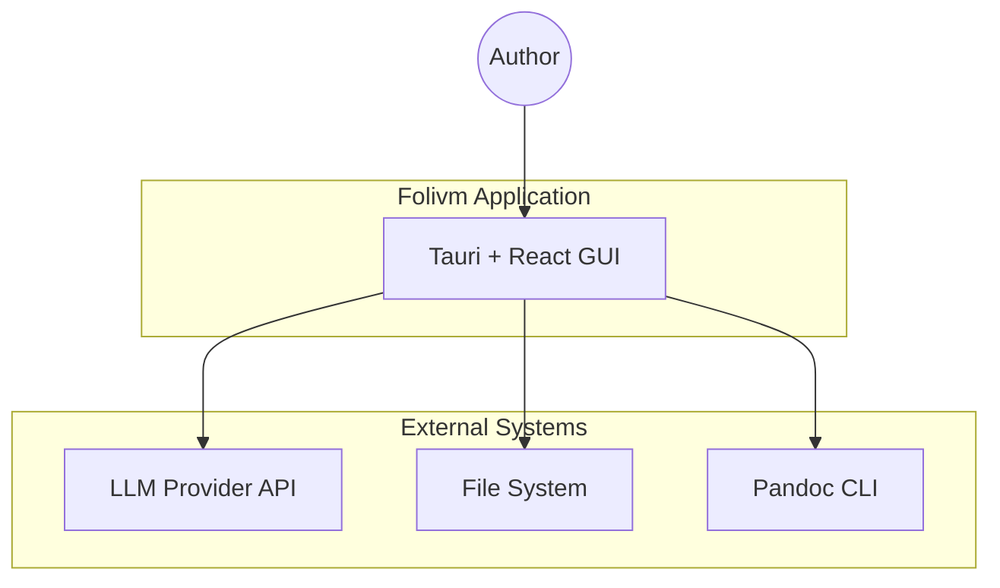
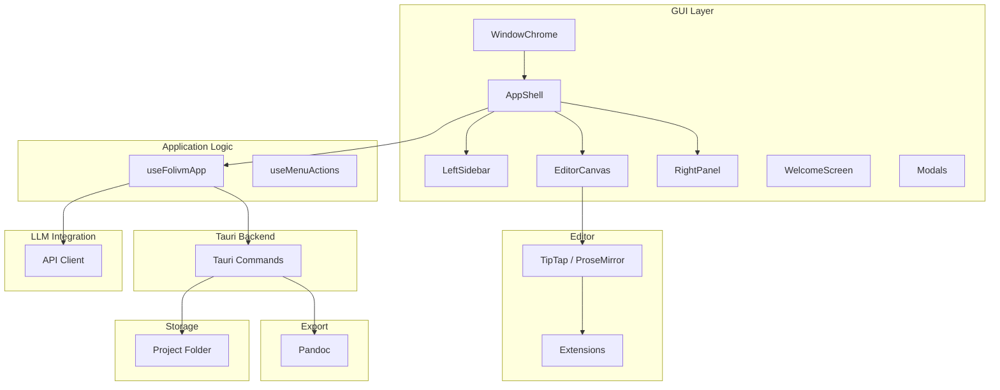
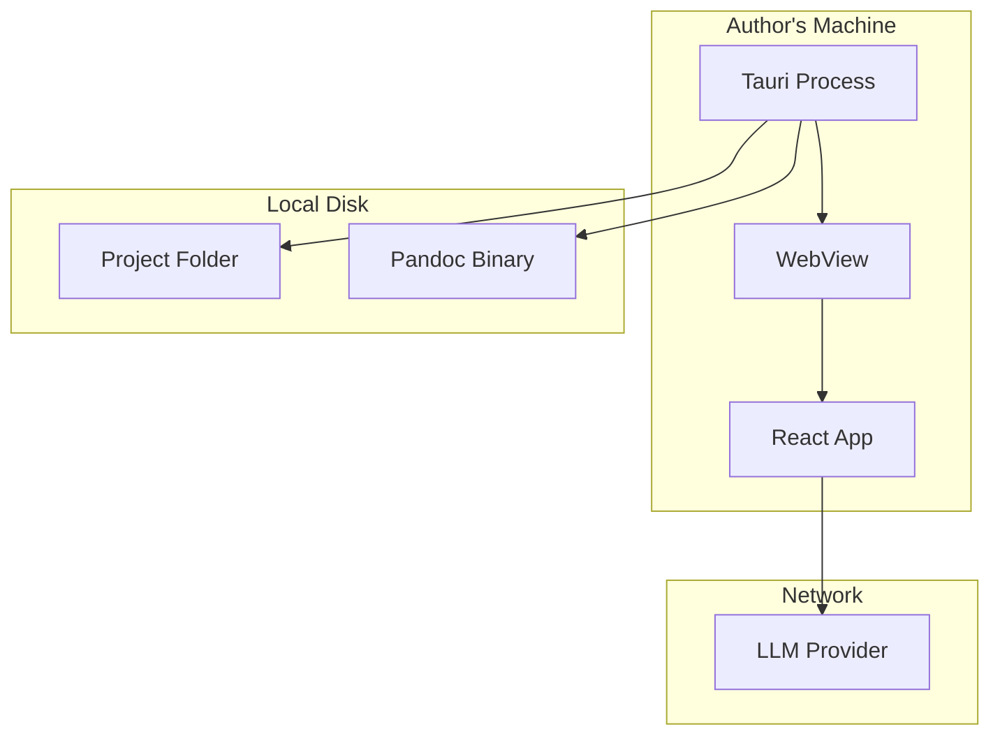

# Software Architecture Document

This document provides a detailed view of the Folivm system architecture. It complements the [High-Level Architecture](../architectural/hla.md) with component-level design, development structure, and cross-cutting concerns. Phase 0 is the primary scope; Phase 1+ extensions are noted where relevant.

---

## 1. Introduction

### 1.1 Purpose

This SAD serves as the authoritative reference for Folivm's system architecture. It supports:

- Onboarding of developers and technical contributors
- Consistency in design decisions across the codebase
- Traceability from requirements to implementation
- Evaluation of proposed changes against architectural constraints

### 1.2 Scope

**In scope.** Phase 0 desktop application architecture: GUI layer, storage layer, export pipeline, and LLM integration. Development view (module structure), logical view (component decomposition), deployment view, and cross-cutting concerns.

**Out of scope.** Phase 1+ features (RAG, deck mode, server-hosted) are described conceptually; detailed design is deferred. Business strategy, user research, and marketing are outside this document.

### 1.3 Definitions and Acronyms

| Term | Definition |
|------|------------|
| **Folivm** | The document format (Pandoc Markdown extended), the product, and the company branding |
| **Cell** | A typed content unit in a Folivm document (prose, data, formula, visual, frame, media) |
| **Rendering mode** | Document, structural (outline), deck, or sheet — a contract on how Folivm source is displayed |
| **ADR** | Architecture Decision Record |
| **FRS** | Functional Requirements Specification |
| **NFR** | Non-Functional Requirement |
| **HLA** | High-Level Architecture |
| **SAD** | Software Architecture Document |
| **LLM** | Large Language Model |

### 1.4 References

| Document | Path |
|----------|------|
| Solution Concept | [docs/strategic/solution-concept.md](../strategic/solution-concept.md) |
| High-Level Architecture | [docs/architectural/hla.md](../architectural/hla.md) |
| Architectural Principles | [docs/architectural/principles.md](../architectural/principles.md) |
| Functional Requirements | [docs/architectural/frs.md](../architectural/frs.md) |
| Non-Functional Requirements | [docs/architectural/nfrs.md](../architectural/nfrs.md) |
| Security & Data Architecture | [docs/architectural/security-data.md](../architectural/security-data.md) |
| ADRs | [docs/architectural/adrs/](../architectural/adrs/) |
| Format Specification | [docs/format/README.md](../format/README.md) |
| Roadmap | [docs/planning/roadmap.md](../planning/roadmap.md) |

---

## 2. Architectural Goals and Constraints

### 2.1 Goals

| Goal | Rationale |
|------|-----------|
| **Document is data** | Storage format = AI exchange format = rendering source. No translation layer. |
| **Semantic over cosmetic** | Structure and meaning stored; appearance derived from theme. |
| **Portable format** | Plain-text Pandoc Markdown; human-readable, diff-able, version-control friendly. |
| **Local-first** | Phase 0 runs entirely locally; no mandatory server or cloud. |
| **Export fidelity** | PDF and DOCX output suitable for direct client delivery without post-processing. |
| **Pluggable LLM** | Provider, region, and model configurable; no hard-coded AI stack. |

### 2.2 Constraints

| Constraint | Source |
|------------|--------|
| Desktop deployment (Tauri) | ADR-0003; cross-platform macOS, Windows, Linux |
| TipTap/ProseMirror for editor | ADR-0004; no alternative editor frameworks |
| Pandoc for export | ADR-0002; PDF and DOCX via Pandoc CLI |
| No telemetry without opt-in | NFR-4.4; privacy requirement |
| Australian English default | NFR-7.1; project standards |

### 2.3 Principles Summary

Derived from [Architectural Principles](../architectural/principles.md). Key principles:

1. **Document is data** — Single representation for storage, AI, and rendering.
2. **Semantic over cosmetic** — Style is theme concern; documents store structure.
3. **Deterministic where correctness matters** — Clause library (Phase 1+) assembly is rule-based.
4. **Brand as first-class object** — Phase 0: print CSS + reference DOCX.
5. **Export fidelity is product requirement** — Not best-effort.
6. **Portable format; deployment evolves** — Format fixed; local vs server varies by phase.
7. **Open format, closed renderer** — Format documented; editor and export are moat.
8. **Local-first is product value** — Explicit positioning, not scope constraint.

---

## 3. System Context

### 3.1 Context Diagram



### 3.2 Stakeholders and Actors

| Actor | Role | Interaction |
|-------|------|-------------|
| **Author** | Primary user; technical consultant producing client deliverables | Creates projects, authors documents, exports to PDF/DOCX, uses LLM assistance |
| **Client** | Recipient of exported documents | Consumes DOCX/PDF; no direct Folivm interaction |
| **LLM provider** | External API (OpenAI, Anthropic, etc.) | Receives document + context; returns suggested content |

### 3.3 External Interfaces

| Interface | Direction | Protocol | Notes |
|-----------|-----------|----------|-------|
| File system | Read/Write | OS APIs via Tauri | Project folder, documents, print.css |
| Pandoc | Invoke | Subprocess (CLI) | PDF/DOCX export |
| LLM API | Outbound | HTTPS REST | User-initiated only; provider configurable |

---

## 4. Architecture Views

### 4.1 Logical View — Component Decomposition



### 4.2 Component Responsibilities

| Component | Responsibility | Key interfaces |
|-----------|----------------|----------------|
| **WindowChrome** | Title bar, menu integration, autosave toggle, theme controls | Props: hasProject, autosaveEnabled, onAutosaveChange |
| **AppShell** | Three-panel layout; orchestrates LeftSidebar, EditorCanvas, RightPanel | Props: project, currentDoc, docContent, onDocContentChange |
| **LeftSidebar** | Project explorer (tree view), search panel; document list by folder | Props: groupedDocs, expandedFolders, onDocumentSelect |
| **EditorCanvas** | TipTap editor host; preview mode; zoom; empty state | Props: content, onChange, viewMode, zoomLevel |
| **RightPanel** | LLM assistant, context file selection, config | Props: contextFiles, selectedContextPaths, onLlmRequest |
| **useFolivmApp** | Central application state; project/document lifecycle; save, export, LLM | Returns: project, currentDoc, docContent, createProject, openDocument, saveDocument, exportPdf, exportDocx |
| **Tauri commands** | create_project, open_project, list_documents, read_file, write_file, export_pdf, export_docx | invoke() from frontend |

### 4.3 Development View — Module Structure

```
src/
├── App.tsx                    # Root component; wires ThemeProvider, useFolivmApp
├── main.tsx                   # Entry; ReactDOM render
├── setupNativeMenu.ts         # Tauri native menu registration
├── ThemeProvider.tsx          # Mode/brand context
├── tokens.css                 # Design tokens (primitives, semantic aliases)
├── types.ts                   # Shared TypeScript types
├── frontmatter.ts             # YAML frontmatter parse/serialize
├── markdown.ts                # Markdown utilities
├── lib/
│   └── utils.ts               # cn(), etc.
├── hooks/
│   ├── useFolivmApp.ts        # Main app state and operations
│   └── useMenuActions.ts      # Native menu action handlers
├── components/
│   ├── shell/
│   │   ├── AppShell.tsx
│   │   ├── WindowChrome.tsx
│   │   ├── LeftSidebar.tsx
│   │   ├── EditorCanvas.tsx
│   │   ├── RightPanel.tsx
│   │   ├── WelcomeScreen.tsx
│   │   └── SearchPanel.tsx
│   ├── modals/
│   │   ├── NewDocumentModal.tsx
│   │   ├── ReferenceDocxModal.tsx
│   │   └── KeyboardShortcutsModal.tsx
│   ├── ui/                    # Radix-based primitives
│   │   ├── AlertDialog.tsx
│   │   ├── Dialog.tsx
│   │   ├── DropdownMenu.tsx
│   │   ├── Label.tsx
│   │   ├── Popover.tsx
│   │   ├── Switch.tsx
│   │   ├── ToggleGroup.tsx
│   │   └── Tooltip.tsx
│   └── FrontmatterPanel.tsx
├── Editor.tsx                 # TipTap editor wrapper
├── BottomToolbar.tsx          # Editor toolbar
└── extensions/
    ├── CalloutExtension.ts    # ::: callout fenced div
    └── FootnoteExtension.ts   # Pandoc inline footnotes

src-tauri/
├── src/
│   ├── lib.rs                 # Tauri commands; FOLDER_SCHEMA, find_pandoc
│   └── main.rs
└── Cargo.toml
```

### 4.4 Process View — Runtime Behaviour

#### Document Load Flow

1. User selects document in LeftSidebar (or opens from menu).
2. `useFolivmApp` invokes `invoke("read_file", { projectPath, path })`.
3. Tauri reads file from disk; returns content string.
4. State updates: `currentDoc`, `docContent`.
5. EditorCanvas receives `docContent`; TipTap parses and renders.
6. `parseDocument(docContent)` yields frontmatter and body for UI display.

#### Save Flow

1. User edits in TipTap; `onDocContentChange` fires (debounced or on blur).
2. `useFolivmApp.saveDocument(content)` invoked.
3. If autosave: debounced save after idle.
4. `invoke("write_file", { projectPath, path, content })`.
5. Tauri writes to disk; success/error surfaced to user.

#### Export Flow

1. User triggers Export PDF or Export DOCX (menu or toolbar).
2. `useFolivmApp.exportPdf()` or `exportDocx()`.
3. Tauri command: `export_pdf` / `export_docx`.
4. Backend: `find_pandoc()` → `Command::new("pandoc")` with appropriate args.
5. Print.css and optional reference DOCX passed to Pandoc.
6. Output written to deliverables/ (or user-chosen path).
7. Status/error returned to frontend.

#### LLM Request Flow

1. User enters prompt in RightPanel; optionally selects context files.
2. User triggers "Generate" or equivalent.
3. `useFolivmApp` builds payload: document content, brief (context/), selected files.
4. HTTPS POST to configured provider (OpenAI, Anthropic).
5. Stream or full response parsed; suggestion displayed.
6. User accepts/rejects; on accept, content inserted into editor.

### 4.5 Deployment View — Physical Architecture



**Phase 0 deployment.** Single-node, local. No server component. Tauri bundles the React app; WebView renders it. Pandoc is an external dependency (PATH or Homebrew paths). LLM API calls are outbound only.

---

## 5. Data Architecture

### 5.1 Document Format

Documents are **Pandoc Markdown** with **YAML frontmatter**. Structure:

```yaml
---
title: Document Title
created: 2026-02-25
updated: 2026-02-25
author: Author Name
# Custom fields as needed
---

# Heading

Prose content. Semantic blocks via fenced divs:

::: callout
Note or key point.
:::
```

See [Format Specification](../format/README.md) for full schema.

### 5.2 Project Folder Schema

| Folder | Purpose |
|--------|---------|
| `inputs/` | Source material — transcripts, research |
| `working/` | Drafts in progress |
| `context/` | Brief, constraints, project parameters |
| `deliverables/` | Final documents; export output |

Optional `Folivm.yaml` in project root for config (e.g. reference DOCX path, LLM config). See [Project Conventions](../format/project-conventions.md).

### 5.3 In-Memory Data Model

- **ProjectInfo**: `{ path: string, documents: string[] }`
- **DocContent**: Raw markdown string (frontmatter + body)
- **GroupedDocs**: `Map<string, string[]>` — folder → document paths
- **SearchMatch**: `{ path: string, line: number, snippet: string }`
- **LlmConfig**: `{ provider: string, api_key: string, model: string }`

### 5.4 Persistence

| Data | Location | Format |
|------|----------|--------|
| Documents | Project folder (inputs/, working/, context/, deliverables/) | .md files |
| Print stylesheet | Project root `print.css` | CSS |
| Reference DOCX | User-configured path (project or global) | .docx |
| LLM API keys | OS credential store (Keychain, Credential Manager) | Platform-specific |
| Project config | `Folivm.yaml` (optional) | YAML |

---

## 6. Technology Stack

| Layer | Technology | Version (indicative) |
|-------|------------|----------------------|
| Desktop | Tauri | 2.x |
| Frontend runtime | React | 19.x |
| Build | Vite | 7.x |
| Language | TypeScript | 5.8.x |
| Editor | TipTap (ProseMirror) | 3.20.x |
| UI components | Radix UI | Various |
| Styling | Design tokens (tokens.css), Tailwind merge | — |
| Export | Pandoc | System-installed |
| Backend | Rust (Tauri) | — |

Path alias: `@/` → `src/`.

---

## 7. Cross-Cutting Concerns

### 7.1 Security

| Concern | Phase 0 Approach |
|---------|------------------|
| Document at rest | Plain text; host OS file permissions; optional full-disk encryption |
| Credentials | API keys in OS credential store (Keychain, Credential Manager) |
| Data in transit | TLS 1.2+ for LLM API calls |
| Telemetry | None without explicit opt-in |

See [Security & Data Architecture](../architectural/security-data.md).

### 7.2 Performance

| NFR | Target |
|-----|--------|
| Editor interactions | P95 < 500 ms |
| Document load | < 2 s for documents up to 100 pages |
| PDF export | < 30 s for up to 50 pages |
| DOCX export | < 20 s for up to 50 pages |
| LLM time to first token | < 5 s typical network |
| Cold start | < 5 s |

### 7.3 Error Handling

- **Pandoc not found**: Clear message; suggest `brew install pandoc`.
- **Export failure**: Surface error to user; no crash.
- **LLM API failure**: Timeout/error surfaced; document state unchanged.
- **File write failure**: Error message; prompt retry.

### 7.4 Extensibility

- **LLM provider pluggability**: Provider, region, model as config; no code change to add provider.
- **Component boundaries**: GUI, storage, export, LLM layers separated.
- **Extension concept**: EP-112 proposes AI assistant as optional extension; core app can run without built-in AI.

---

## 8. Architecture Decisions Summary

| ADR | Decision |
|-----|----------|
| [ADR-0001](../architectural/adrs/ADR-0001-llm-provider-pluggability.md) | LLM provider pluggability; provider/region/model config; Australian-region support |
| [ADR-0002](../architectural/adrs/ADR-0002-docx-export-library-selection.md) | Pandoc-only for Phase 0 PDF and DOCX |
| [ADR-0003](../architectural/adrs/ADR-0003-tauri-desktop-framework.md) | Tauri for desktop framework |
| [ADR-0004](../architectural/adrs/ADR-0004-tiptap-editor-framework.md) | TipTap (ProseMirror) for editor |

---

## 9. Future Considerations (Phase 1+)

| Component | Phase 1+ Change |
|-----------|-----------------|
| Structural (outline) mode | New rendering mode; heading hierarchy as tree |
| RAG | Index project folder; retrieval-augmented LLM context |
| Deck mode | Slide boundaries; PPTX export |
| Server-hosted | Optional deployment model |
| DMS integration | iManage, NetDocuments (Phase 2+) |

See [Roadmap](../planning/roadmap.md) and [HLA Future Layers](../architectural/hla.md#future-layers-phase-1).

---

## 10. Glossary

| Term | Definition |
|------|------------|
| **Fenced div** | Pandoc block syntax `::: className` for semantic blocks |
| **Reference DOCX** | Pandoc template for DOCX styling |
| **Print stylesheet** | CSS used for PDF export (typically `print.css`) |
| **Frontmatter** | YAML block at start of document for metadata |
| **Project folder** | Directory with inputs/, working/, context/, deliverables/ |
| **Rendering mode** | Document, structural, deck, or sheet — how content is displayed |
| **BYOK** | Bring-your-own-key; user supplies LLM API key |

---

*Previous: [HLA](../architectural/hla.md) · Next: [ADRs](../architectural/adrs/) · See also: [Principles](../architectural/principles.md), [FRS](../architectural/frs.md), [Security & Data](../architectural/security-data.md)*
