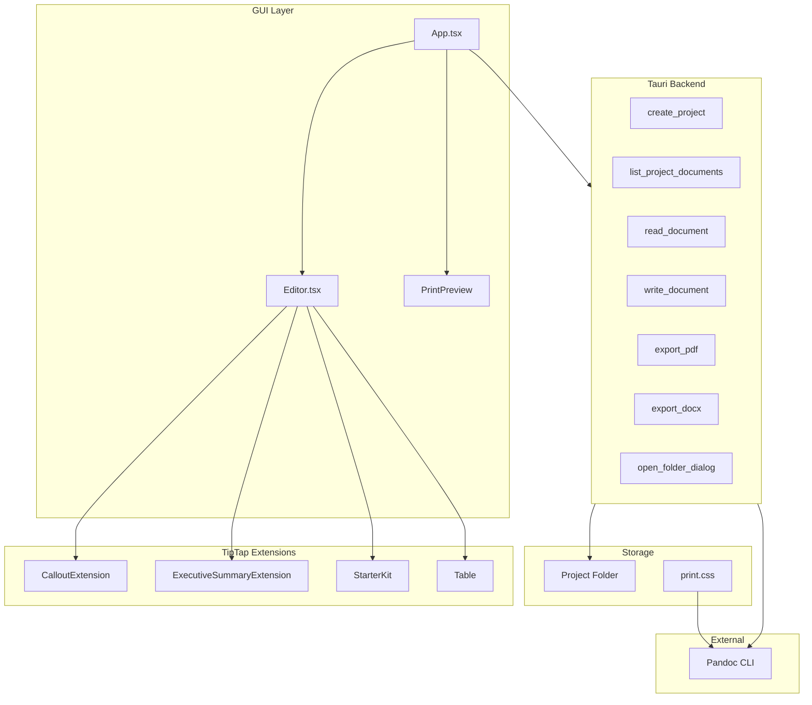

# Folivm Codebase Review and Way Forward

## Current State Summary

The project is **Phase 0 (PoC)** — a Tauri desktop app with TipTap editor, project folder schema, and Pandoc export. Most core capabilities are implemented; several gaps remain before the Phase 0 success criterion: *the author uses Folivm for their next real client deliverable*.

**Strategic context (post-2026-02-22 edits):** Product name is **Folivm**; format name is **Folivm**. Principles and operating model now explicitly frame **local-first as a product value** (not a Phase 0 constraint), a **three-tier commercial model** (Core one-time purchase, Folivm AI optional subscription, Folivm Sync optional subscription), and **brand manifest direction** (Variables + Modes, Phase 0 = CSS custom properties). See [principles.md](../architectural/principles.md), [operating-model.md](operating-model.md), [RAIDD assumptions](../governance/raidd/assumptions.yaml), [RAIDD issues](../governance/raidd/issues.yaml).

---

## What's Implemented

| Epic | Status | Notes |
|------|--------|------|
| **EP-006** Tauri desktop shell | Done | Tauri 2, folder picker (rfd), window shell |
| **EP-003** Project folder context | Done | create/open project, list docs, read/write |
| **EP-001** Rich Markdown editor | Partial | TipTap, callout/executive-summary, tables, H2, lists; frontmatter as raw text |
| **EP-002** Element-based styling | Partial | print.css + preview; semantic blocks missing from project print.css |
| **EP-004** Export PDF/DOCX | Done | Pandoc CLI; no reference DOCX UI |
| **EP-005** LLM assistance | Not started | |
| **EP-007** Format documentation | Drafted | [docs/format/](../format/) — frontmatter, semantic blocks, project conventions |

---

## Critical Gaps (Block Phase 0 Success)

### 1. Print stylesheet omits semantic blocks

[public/print.css](../../public/print.css) (and the copy created in each project) lacks `.callout` and `.executive-summary` styles. The editor preview uses App.css which has them, but **PDF export** uses the project `print.css` — so callouts and executive summaries render as unstyled divs in exported PDFs.

**Fix:** Add `.callout` and `.executive-summary` to [public/print.css](../../public/print.css) (aligned with App.css print-preview rules). Projects created after that will get the correct styles; existing projects need a one-time sync or migration note.

### 2. Editor feature gaps vs FR-2.2

- **Headings:** Bubble menu only has H2. FR-2.2 requires H1–H4.
- **Footnotes:** Implemented (Pandoc inline `^[content]`; bubble menu insert/edit).
- **H1:** No quick way to set document title heading.

**Fix:** Add H1, H3, H4 to bubble menu (or a dropdown). Add footnote support per Pandoc (TipTap extension or custom node). *Status: H1–H4 added; footnotes implemented.*

### 3. Pandoc not found on export

Export fails with "Failed to run pandoc: No such file or directory (os error 2)". The Tauri process cannot find `pandoc` in its PATH — common when Pandoc is installed via Homebrew (`/opt/homebrew/bin` or `/usr/local/bin`) and the app runs with a minimal environment.

**Fix:** In [src-tauri/src/lib.rs](../../src-tauri/src/lib.rs), add a fallback: if `pandoc` is not found on PATH, try `/opt/homebrew/bin/pandoc` and `/usr/local/bin/pandoc` (macOS). Use a helper that attempts each path until one succeeds.

### 4. Edit/Preview paradigm — user wants single WYSIWYG

Current UX toggles between "Edit" and "Preview" modes. The author wants a single view where **what you edit is what you print** — trust that the editor display matches export output.

**Fix:** Remove the Edit/Preview toggle. Apply print stylesheet (or equivalent) to the editor content area so the editor renders with the same typography, spacing, and semantic block styling as the exported PDF. One view; WYSIWYG for print. Files: [src/App.tsx](../../src/App.tsx) (remove toggle, remove `PrintPreview` component usage), [src/App.css](../../src/App.css) (apply print-like styles to `.ProseMirror` or editor container).

### 5. Editor labels: Folivm, not Folivm

Product name is Folivm; format name is Folivm. User-facing labels (header, window title, page title) incorrectly show "Folivm".

**Fix:** Change all user-facing labels to "Folivm": [src/App.tsx](../../src/App.tsx) header `<h1>`, [src-tauri/tauri.conf.json](../../src-tauri/tauri.conf.json) `productName` and window `title`, [index.html](../../index.html) `<title>`. Keep internal identifiers (e.g. CSS class `Folivm-table`) or rename for consistency — user intent is visible labels.

---

## Important Gaps (Should fix before Phase 0 exit)

### 6. Reference DOCX template (US-032)

Export commands accept `reference_docx: Option<String>` but the UI always passes `null`. Authors cannot specify a branded DOCX template.

**Fix:** Add project-level config (e.g. `Folivm.yaml` or `.folivm`) or a settings UI to store and use a reference DOCX path for export. Align with Principle 10 (brand = CSS custom properties + reference DOCX in Phase 0).

### 7. Frontmatter editing (US-004)

Documents store YAML frontmatter; the editor treats the whole file as content. New documents get generated frontmatter; existing frontmatter is editable only as raw text. No structured view or validation.

**Fix (minimal):** Keep raw editing but add basic YAML validation on save and surface errors. **Fix (full):** Add a frontmatter panel (title, created, updated, author) that reads/writes the YAML block. Depends on desired UX vs effort.

### 8. Stale artefacts

- [TODO.md](../../TODO.md): All Phase 0 items still unchecked despite substantial implementation.
- [docs/execution/backlog.md](../execution/backlog.md): Epic/story statuses say "Not started" though EP-006, EP-003, EP-001 (partial), EP-004 are implemented.

**Fix:** Update TODO and backlog to reflect current status.

---

## Documentation and Governance (Updated 2026-02-22)

Your recent edits are reflected below. The plan is aligned with the current doc set.

### Principles ([docs/architectural/principles.md](../architectural/principles.md))

- **Principles 9–11** now in place: (9) Adoption and distribution matter (WordPerfect lesson; go-to-market as authoring environment for documents exported to Word); (10) Brand manifest uses Variables + Modes architecture (Figma analogy; Phase 0 = CSS custom properties, Phase 2 = full manifest); (11) Local-first is a product value, not a scope constraint (commitment covenant; core features never gated behind subscriptions). References DEC-017 and operating-model.md.

### Operating model ([docs/planning/operating-model.md](operating-model.md))

- **No longer a stub.** Full draft: three-tier commercial model (Tier 1 Folivm Core one-time purchase, Tier 2 Folivm AI optional subscription, Tier 3 Folivm Sync optional subscription); rationale vs full SaaS; Phase 0 and Phase 1+ development approach; support model; open questions (pricing, licence management, commitment covenant mechanism).

### RAIDD

- **Assumptions ([docs/governance/raidd/assumptions.yaml](../governance/raidd/assumptions.yaml)):** A-001 rewritten (target market heterogeneous deployment preferences; local-first segment; enshittification fatigue); A-009 and A-010 added (perpetual-licence viability; unbundled AI subscription acceptance).
- **Issues ([docs/governance/raidd/issues.yaml](../governance/raidd/issues.yaml)):** I-007 in progress with resolution direction (three-tier model; DEC-017; operating-model.md).
- **Decisions:** DEC-017 (three-tier model) referenced in principles and operating model. Run `scripts/generate_raidd.py` to rebuild compiled RAID output.

### NOTES ([NOTES.md](../../NOTES.md))

- 2026-02-22 session notes (second pass) capture: Figma Variables + Modes, enshittification/local-first positioning, three-tier monetisation, commitment covenant, and the doc updates above.

**REFACTOR-PLAN:** Problem statement, solution concept, principles, HLA, roadmap, PRD lean appear aligned with Phase 0. RAIDD and operating model are now updated; NOTES addendum and session history are present.

---

## Technical Debt

| Item | Impact | Action |
|------|--------|--------|
| `@tauri-apps/plugin-fs` in package.json | Unused; file ops use Tauri commands | Remove from dependencies |
| markdown.ts frontmatter handling | Round-trip must preserve frontmatter | Verify; ensure fenced-div parsing does not corrupt frontmatter |

---

## Recommended Way Forward

### Option A — Minimal path to Phase 0 success (1–2 days)

Focus on making a real deliverable possible:

1. **Add semantic block styles to public/print.css** — unblocks PDF export for callouts/executive-summary.
2. **Add H1, H3, H4 to bubble menu** — quick win for structure.
3. **Update TODO and backlog** — accurate status.

**Defer:** Footnotes, reference DOCX UI, structured frontmatter, LLM integration.

### Option B — Full Phase 0 scope (1–2 weeks)

Complete all Phase 0 epics and stories:

1. All items in Option A.
2. **Footnote support** — TipTap extension or custom handling.
3. **Reference DOCX UI** — project config + file picker (align with Principle 10).
4. **Frontmatter editing** — at least validation; optionally a panel.
5. **LLM assistance (EP-005)** — API integration, context loading, accept/reject suggestions; BYOK as per operating model.
6. **Documentation cleanup** — backlog/TODO status; regenerate RAIDD if needed.

### Option C — Fix critical gaps, then validate (implemented + ready)

1. ~~Print.css semantic blocks (critical).~~ **Done.**
2. ~~H1/H3/H4 in bubble menu.~~ **Done.**
3. **Pandoc path fallback** — Try PATH, then `/opt/homebrew/bin/pandoc`, `/usr/local/bin/pandoc` in Tauri export commands.
4. **Single WYSIWYG paradigm** — Remove Edit/Preview toggle; apply print styles to editor; one view = what you print.
5. **Folivm rebrand** — Change user-facing labels (header, window title, page title) from "Folivm" to "Folivm".
6. **Try the Phase 0 workflow:** Create project → author real client doc → export PDF/DOCX.
7. Log friction and bugs; prioritise fixes from that experience.

---

## Architecture Diagram (Current)

---

---

## Implementation Checklist (Option C — Ready to execute)

| # | Task | Status | Files |
|---|------|--------|-------|
| 1 | Add semantic block styles to print.css | Done | [public/print.css](../../public/print.css) |
| 2 | Add H1, H3, H4 to bubble menu | Done | [src/Editor.tsx](../../src/Editor.tsx) |
| 3 | Pandoc path fallback (PATH + Homebrew paths) | Pending | [src-tauri/src/lib.rs](../../src-tauri/src/lib.rs) |
| 4 | Single WYSIWYG — remove Edit/Preview, apply print styles to editor | Pending | [src/App.tsx](../../src/App.tsx), [src/App.css](../../src/App.css) |
| 5 | Folivm rebrand — header, window title, page title | Pending | [src/App.tsx](../../src/App.tsx), [src-tauri/tauri.conf.json](../../src-tauri/tauri.conf.json), [index.html](../../index.html) |

---

## Key Files Reference

| Purpose | Path |
|---------|------|
| Editor + round-trip | [src/Editor.tsx](../../src/Editor.tsx) |
| Markdown parsing | [src/markdown.ts](../../src/markdown.ts) |
| Semantic block extensions | [src/extensions/CalloutExtension.ts](../../src/extensions/CalloutExtension.ts) |
| Tauri commands | [src-tauri/src/lib.rs](../../src-tauri/src/lib.rs) |
| Print stylesheet (source) | [public/print.css](../../public/print.css) |
| Preview + editor styles | [src/App.css](../../src/App.css) |
| Principles (incl. 9–11) | [docs/architectural/principles.md](../architectural/principles.md) |
| Operating model (three-tier) | [docs/planning/operating-model.md](operating-model.md) |
| RAIDD assumptions/issues | [docs/governance/raidd/](../governance/raidd/) |
